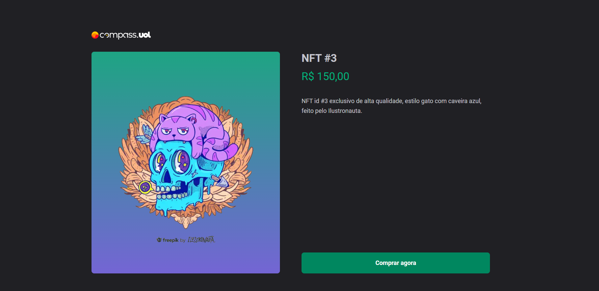

<h1> Projeto Acelereção Final - React 🚀</h1>
<h2> Compass Shop 🛒</h2>

> Segundo Projeto

Construido um e-commerce para venda de NFT com integração ao Stripe para cuidar e gerenciar a compra dos produtos.

## O que foi criado 
+ E-commerce
+ Fluxo completo até o checkout
+ Integração com Stripe
+ Gerenciamento de produto e Pagamento com Stripe
+ Carrossel para mostrar os produtos
+ Fluxo com tecnologias e funcionalidades mais atuais
+ Renderização com SSG, pre-renderizando a página deixando o fluxo rápido

## Tecnologias

+ React
+ Next.js
+ Typescript
+ Stitches
+ Stripe

## Como utilizar 

1. Clonar o repositório, instalar as dependências
'yarn / npm install'
2. Após baixar as dependências, executar o server de desenvolvimento
'npm run dev ou yarn dev'
3. Abrir link que foi executado o projeto
'http://localhost:3000'
4. Para realizar a compra, utilizar o número do cartão
'4242 4242 4242 4242'
uma data posterior a atual e qualquer número de CVV.